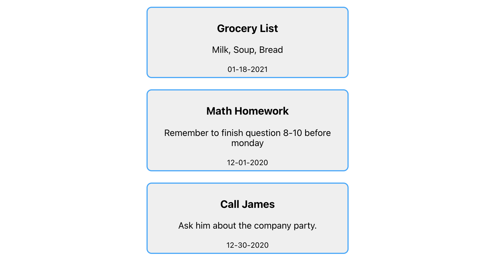
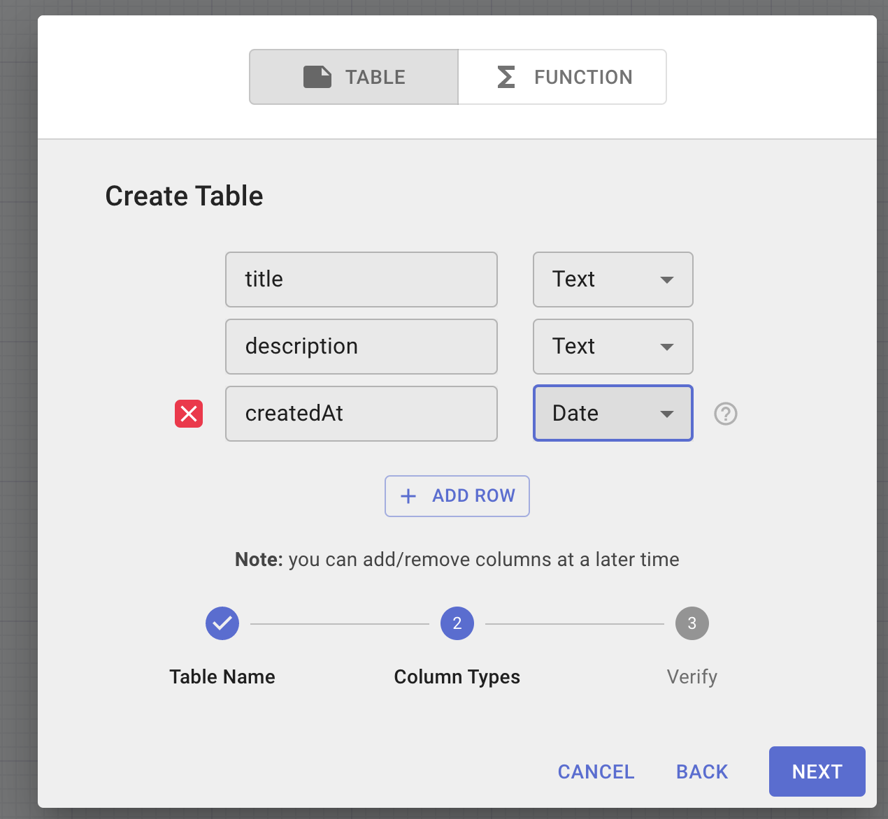
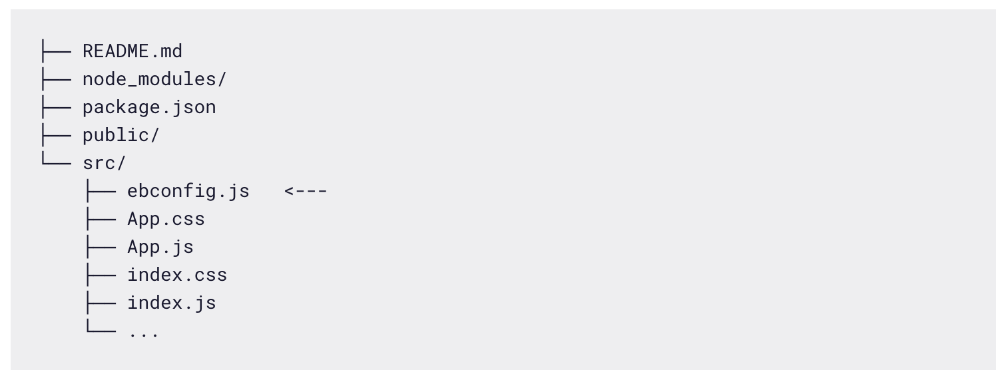

# serverless-database-react
How to Add a Serverless Database to your React Projects

A common requirement for modern web applications is a backend database to serve and query real-time data. The traditional implementation of a backend database can often be quite precarious and cost-ineffective.

Thankfully, over the past five years, serverless technology has come to the forefront of modern application development.

In this context, serverless means that the developer doesn't have to set up and administer an actual server to host their database and other backend services. Rather, they use a secure provider to host their backend and connect to it directly from the front end application code. No need to worry about scalability and systems.

This application architecture is relatively new, but it's cost-effective and dramatically increases productivity. These benefits play well to those using React to build modern, production applications. Plus, services like Easybase have created serverless libraries built specifically for stateful React components.

This article will demonstrate how easy it is to use the easybase-react library to implement a stateful, serverless database in a new React project. The below example will be a straightforward note-taking app, but serverless architecture has the potential to streamline all sorts of applications.

#### Table of Contents:
- How to Initialize React Project & Components
- How to Set Up the Serverless Database
- Mutable Database array

First step is always:
```javascript
npx create-react-app serverless-database-react
```
After that completes, let's install the serverless library:
```javascript
cd serverless-database-react && npm install easybase-react
```
I added some example data called backendData, but we'll replace this with a real-time database in the next step. Here's a screenshot of my current implementation for reference:


Now lets set up da serverless database with `Easybase`:
Easybase is a react-specific library that is built for serverless applications.

I've used this platform for multiple projects and by far the most valuable aspects of easybase-react are the automatic session caching and secure data fetching. Implementing these modules manually is a major hassle and can be a whole project within itself.

To start, we are going to make two changes to App.js. First, let's use that easybase-react package that we installed earlier by adding an import line to the top of App.js. Bring in EasybaseProvider and useEasybase.

Second, Wrap the Notes component in the EasybaseProvider component.

App.js should now look as follows. Note that I also brought in the useEffect hook from React.

```javascript
import './App.css';
import { EasybaseProvider, useEasybase } from 'easybase-react';
import { useEffect } from 'react';

function App() {
  return (
    <div className="App" style={{ display: "flex", justifyContent: "center" }}>
      <EasybaseProvider>
        <Notes />
      </EasybaseProvider>
    </div>
  );
}
```

The EasybaseProvider component will give all children components valid access to the useEasybase hook, once we pass in the required configuration.

EasybaseProvider has a prop called ebconfig which is a single file that authenticates and secures all connections from within our React project.

Here's how we can get an ebconfig token associated with a custom data table:

- Login to Easybase or create a free account
- Open the Create Table dialog via the '+' button in the bottom-left button group
- Give your table a name and make columns that correspond to those of the example array (title, description, createdat)




After adding content to your table ( title: call James, Description etc) and saved it, 
- Navigate to Integrate tab and create a new React integration
- In the right-hand drawer, enable Active, Testing Mode, and read and write in Permissions. Then download the React token and click Save in the top-right
- Place the newly downloaded ebconfig.js file within the src/ folder of your project



- Finally, import this file into App.js and pass it as the ebconfig prop of EasybaseProvider like so:
```javascript
import './App.css';
import { EasybaseProvider, useEasybase } from 'easybase-react';
import { useEffect } from 'react';
import ebconfig from './ebconfig';

function App() {
  return (
    <div className="App" style={{ display: "flex", justifyContent: "center" }}>
      <EasybaseProvider ebconfig={ebconfig}>
        <Notes />
      </EasybaseProvider>
    </div>
  );
}

// ...
```

Just like that, our project is configured for serverless functionality. All that's left to do is utilize the functions provided by the useEasybase hook, which we'll do in the next section.
